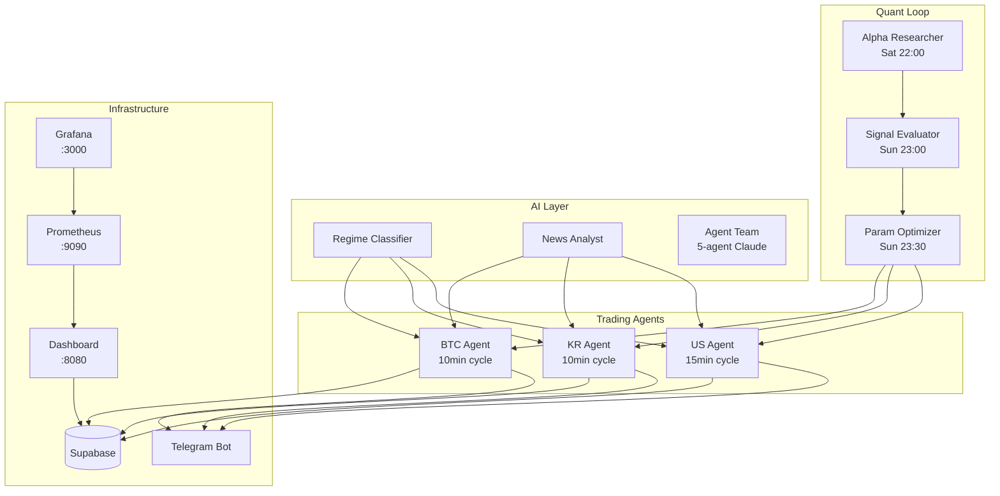

# OpenClaw Trading System

[](https://github.com/zln02/openclaw-trading/actions)


> BTC · KR Stocks · US Stocks 자동매매 플랫폼 — AI 에이전트 + 퀀트 리서치 루프

## 주요 기능

- **3-Market Trading**: BTC (Upbit 실거래), KR (Kiwoom 모의), US (yfinance 시뮬)
- **AI Agent Team**: Claude 5-에이전트 (Orchestrator + Analyst×2 + Risk + Reporter)
- **ML Pipeline**: XGBoost + LightGBM + CatBoost Stacking Ensemble
- **Quant Research Loop**: 주간 자동 IC/IR 평가 → 파라미터 최적화
- **Smart Execution**: SmartRouter (MARKET/TWAP/VWAP), Slippage Tracker
- **Real-time Dashboard**: React + FastAPI SPA, Prometheus + Grafana
- **Telegram Bot**: 13개 명령어 (/status, /drawdown, /daily_loss, /sell_all 등)
- **Risk Management**: DrawdownGuard, PositionSizer(Kelly), CorrelationMonitor, CircuitBreaker

## 아키텍처



## Quick Start

```bash
# 1. Clone
git clone https://github.com/zln02/openclaw-trading.git
cd openclaw-trading

# 2. Environment
cp .env.example .env
# .env에 API 키 설정 (Upbit, Supabase, Telegram, OpenAI/Anthropic)

# 3. Docker (권장)
docker compose up -d

# 4. Local Dev
python -m venv .venv && source .venv/bin/activate
pip install -r requirements.txt
pre-commit install           # 커밋 훅 활성화 (detect-private-key, flake8, isort, 대용량 파일 차단)
python btc/btc_dashboard.py  # Dashboard at :8080
```

## 프로젝트 구조

```text
├── btc/              # BTC 에이전트 + FastAPI 라우트
├── stocks/           # KR/US 에이전트 + Kiwoom + ML + Telegram
├── agents/           # AI 전략 계층 (레짐, 뉴스, 5-에이전트 팀)
├── quant/            # 퀀트 엔진 (백테스트, 팩터, 포트폴리오, 리스크)
├── execution/        # 주문 실행 (SmartRouter, TWAP, VWAP)
├── common/           # 공통 인프라 (config, logger, Supabase, retry)
├── dashboard/        # React + Vite 프론트엔드
├── secretary/        # 자율 리서치 + Notion 통합
├── tests/            # pytest 테스트 스위트
├── scripts/          # 크론 래퍼 + 유틸
├── docs/             # 문서
└── brain/            # AI 분석 결과 저장소 (런타임)
```

## Docker Services (7개)

| Service | Port | 역할 |
|---------|------|------|
| dashboard | 8080 | FastAPI + React SPA |
| btc-agent | - | BTC 매매 루프 (600s) |
| kr-agent | - | KR 매매 루프 (600s) |
| us-agent | - | US 매매 루프 (900s) |
| telegram-bot | - | 텔레그램 명령어 |
| prometheus | 9090 | 메트릭 수집 |
| grafana | 3000 | 대시보드 시각화 |

## Telegram 명령어

| 명령어 | 설명 |
|--------|------|
| /status | 계좌 + 보유 현황 |
| /market | 시장 요약 |
| /risk | 리스크 메트릭 |
| /drawdown | 드로우다운 가드 상태 |
| /daily_loss | 오늘 시장별 손익 |
| /stop / /resume | 매매 일시정지/재개 |
| /sell_all | 전량 매도 (확인 필요) |
| /review | 주간 성과 리뷰 |
| /agents | 에이전트 결정 로그 |
| /ask | AI 질의 |
| /help | 도움말 |

## 개발

```bash
# 테스트
pytest -v

# 린트
flake8 --max-line-length=120 --ignore=E501,W503,E402 common/ btc/ stocks/ agents/ quant/

# 프론트엔드
cd dashboard && npm run dev
```

## 문서

- `CLAUDE.md` — AI 에이전트 개발 가이드
- `CHANGELOG.md` — 버전 이력
- `docs/API.md` — API 엔드포인트
- `docs/cron_timing_matrix.md` — 크론 스케줄
- `agents/README.md` — 에이전트 모듈 설명

## License

MIT License — see `LICENSE`
