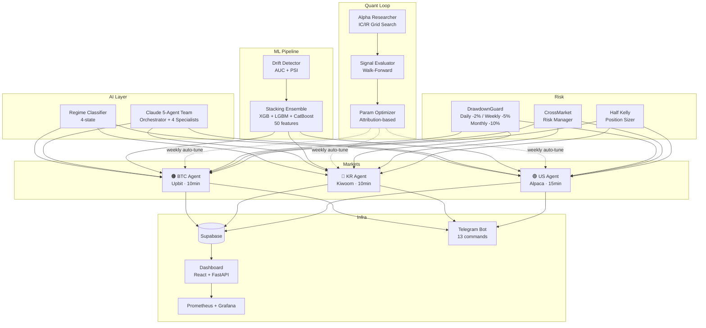

<p align="center">
  <h1 align="center">Quant Agent</h1>
  <p align="center">
    AI-Powered Multi-Market Automated Trading System
    <br />
    <strong>BTC · KR Stocks · US Stocks</strong> — 3개 시장 동시 자동매매
  </p>
</p>

<p align="center">
  <a href="https://github.com/zln02/quant-agent/actions/workflows/ci.yml"></a>
  
  
  
  
  
</p>

> **Warning**: 이 프로젝트는 교육 및 연구 목적입니다. 실제 자금 투자 시 손실이 발생할 수 있으며, 투자 결정에 대한 책임은 본인에게 있습니다.

---

## Live Trading Performance

<!-- LIVE-STATS:START -->
> Last updated: `2026-05-08 04:16 UTC` via GitHub Actions

| Market | Trades | Win Rate | Avg PnL |
|--------|--------|----------|---------|
| BTC | 0 | — | — |
| KR | 0 | — | — |
| US | 0 | — | — |
<!-- LIVE-STATS:END -->

<sub>Stats auto-updated daily from Supabase via <a href=".github/workflows/update-readme.yml">GitHub Actions</a></sub>

---

## What Makes This Different

개인 자동매매 시스템 중 **상급(Advanced)** 수준 — 소규모 헤지펀드 구조에 가까운 아키텍처

| | Quant Agent | Freqtrade | QuantConnect | 3Commas | 젠포트 |
|---|:---:|:---:|:---:|:---:|:---:|
| **Multi-Market (BTC+KR+US)** | ✅ | ❌ | partial | ❌ | ❌ |
| **ML Ensemble (3-model stacking)** | ✅ | partial | ❌ | ❌ | ❌ |
| **Cross-Market Risk Manager** | ✅ | ❌ | ❌ | ❌ | ❌ |
| **AI Agent Team (Claude 5-agent)** | ✅ | ❌ | ❌ | ❌ | ❌ |
| **Concept Drift Detection** | ✅ | partial | ❌ | ❌ | ❌ |
| **Auto Alpha Research Loop** | ✅ | Hyperopt | ❌ | ❌ | ❌ |
| **Regime Classification (4-state)** | ✅ | ❌ | ❌ | ❌ | ❌ |
| **Half Kelly Position Sizing** | ✅ | ❌ | ❌ | ❌ | ❌ |

### Key Differentiators

- **3-Market Unified Risk**: BTC(Upbit) + KR(Kiwoom) + US(Alpaca)를 `CrossMarketRiskManager`로 합산 리스크 관리
- **Self-Improving Loop**: `Alpha Researcher` → `Signal Evaluator`(IC/IR) → `Param Optimizer` → 자율 파라미터 반영
- **Extreme Fear Override**: Fear & Greed ≤ 15에서 행동재무학 기반 역발상 매수
- **Dual Drift Detection**: AUC 기반 실시간 + PSI 기반 피처 분포 이중 감시

---

## Architecture



---

## Tech Stack

| Category | Technologies |
|----------|-------------|
| **Trading** | Upbit API, Kiwoom REST, Alpaca Trade API |
| **ML** | XGBoost, LightGBM, CatBoost, scikit-learn (50 features, Walk-Forward CV) |
| **AI** | Claude API (Opus/Sonnet/Haiku), OpenAI GPT-4o-mini |
| **Backend** | Python 3.11, FastAPI, Supabase (PostgreSQL) |
| **Frontend** | React 18, Vite, Lightweight Charts |
| **Monitoring** | Prometheus, Grafana, Telegram Bot |
| **DevOps** | Docker Compose (7 services), GitHub Actions CI/CD, pytest (65+ tests) |
| **Execution** | SmartRouter (MARKET/TWAP/VWAP), Idempotency Keys |
| **Platform** | OpenClaw Gateway + Claw3D Studio (3D Agent Workspace) |

---

## Quick Start

```bash
# Clone
git clone https://github.com/zln02/quant-agent.git && cd quant-agent

# Environment
cp .env.example .env   # API 키 설정: Upbit, Supabase, Telegram, Claude/OpenAI

# Docker (권장)
docker compose up -d    # 7개 서비스 (dashboard, 3 agents, telegram, prometheus, grafana)

# Local Dev
python -m venv .venv && source .venv/bin/activate
pip install -r requirements.txt
python btc/btc_dashboard.py   # Dashboard at :8080
```

---

## Project Structure

```
quant-agent/
├── btc/                 # BTC 에이전트 + FastAPI 대시보드 + API 라우트
├── stocks/              # KR/US 에이전트, Kiwoom 클라이언트, ML 모델
├── agents/              # AI 전략 (Regime Classifier, News Analyst, 5-Agent Team)
├── quant/               # 퀀트 엔진
│   ├── alpha_researcher.py    # 파라미터 그리드서치 (IC/IR)
│   ├── signal_evaluator.py    # 신호 품질 측정
│   ├── param_optimizer.py     # 자율 파라미터 반영
│   ├── drift_detector.py      # AUC + PSI 드리프트 감지
│   └── risk/                  # DrawdownGuard, PositionSizer, CorrelationMonitor
├── execution/           # SmartRouter (TWAP/VWAP), SlippageTracker
├── common/              # Config, Logger, Supabase, Telegram, Retry
├── api/                 # Public API, WebSocket, Webhook
├── dashboard/           # React + Vite SPA
├── scripts/             # Cron wrappers, utilities
├── tests/               # pytest 테스트 (65+ cases)
└── brain/               # Runtime: ML models, alpha params, logs (gitignored)
```

---

## Risk Management

3-tier 독립 방어 체계:

| Layer | Component | Threshold |
|-------|-----------|-----------|
| **Position** | Half Kelly Sizing | `min(kelly, config_ratio)` |
| **Daily** | DrawdownGuard Daily | -2% → 매수 차단 |
| **Weekly** | DrawdownGuard Weekly | -5% → 포지션 50% 축소 |
| **Monthly** | DrawdownGuard Monthly | -10% → 전량 청산 |
| **Cross-Market** | CrossMarketRiskManager | 총 노출 80%, 단일 시장 50% 제한 |
| **Circuit Breaker** | 연속 손실 카운터 | N회 연속 → 자동 정지 |

---

## Automated Quant Loop

```
┌─ Sat 22:00 ─────────────────────────────────────────────────┐
│  Alpha Researcher: 파라미터 그리드서치 (IC/IR 기반)          │
│  → brain/alpha/best_params.json                             │
└─────────────────────────────────────────────────────────────┘
         ↓
┌─ Sun 23:00 ─────────────────────────────────────────────────┐
│  Signal Evaluator: 신호별 IC/IR 측정 + 가중치 조정           │
│  → brain/signal/weights.json                                │
└─────────────────────────────────────────────────────────────┘
         ↓
┌─ Sun 23:30 ─────────────────────────────────────────────────┐
│  Param Optimizer: Attribution 기반 자율 파라미터 반영         │
│  → 에이전트 config 자동 업데이트 + 텔레그램 리포트           │
└─────────────────────────────────────────────────────────────┘
         ↓
┌─ Daily 08:30 ───────────────────────────────────────────────┐
│  ML Retrain: 50+ 체결 시 Walk-Forward 재학습                 │
│  → brain/ml/horizon_{1d,3d,10d}/                            │
└─────────────────────────────────────────────────────────────┘
```

---

## Development

```bash
# Tests
pytest -v                                    # 65+ tests

# Lint
flake8 --max-line-length=120 --ignore=E501,W503,E402,E702

# ML Retrain
PYTHONPATH=. python stocks/ml_model.py train_all

# Frontend
cd dashboard && npm install && npm run dev
```

---

## Infrastructure

### GCP e2-small (2 vCPU, 8GB RAM)

| Service | Port | Bind | Description |
|---------|------|------|-------------|
| `OpenClaw Gateway` | 18789 | localhost | WebSocket AI Gateway (LLM 라우팅) |
| `Claw3D Studio` | 3002 | 0.0.0.0 | 3D Agent Workspace (Next.js + Three.js) |
| `dashboard` | 8080 | 0.0.0.0 | FastAPI + React SPA (자동매매 대시보드) |
| `btc-agent` | — | — | BTC trading loop (10min) |
| `kr-agent` | — | — | KR stock trading loop (10min) |
| `us-agent` | — | — | US stock trading loop (15min) |
| `telegram-bot` | — | — | 13 commands (/status, /risk, /sell_all...) |
| `prometheus` | 9090 | 0.0.0.0 | Metrics collection |
| `grafana` | 3000 | 0.0.0.0 | Dashboard visualization |

### OpenClaw + Claw3D 연동 구조

```
Browser → Claw3D (:3002) → OpenClaw Gateway (:18789) → LLM Provider (OAuth)
```

- **Gateway 인증**: Token 기반 (`oc-secure-*`)
- **LLM 모델**: `openai-codex/gpt-5.1` (OAuth, API 키 불필요)
- **Studio 접근**: `STUDIO_ACCESS_TOKEN` 쿠키 인증
- **에이전트**: main (46개 스킬), agent-2 (보조)

### 주요 스킬 (OpenClaw)

| 스킬 | 설명 |
|------|------|
| `kiwoom-api` | 키움증권 REST API (주가 조회, 계좌 자산) |
| `opendart-api` | 금감원 DART 공시/재무제표 |
| `coding-agent` | Codex/Claude Code 위임 코딩 |
| `github` / `gh-issues` | GitHub PR/이슈 관리 |
| `gog` | Google Workspace (Gmail, Calendar, Drive) |
| `weather` | 날씨 조회 (wttr.in) |

---

## Security

- All secrets via environment variables (zero hardcoding)
- Dashboard: Basic Auth + Rate Limiting (5 attempts / 5min)
- Docker: non-root user (`openclaw`, uid=1000)
- OpenClaw Gateway: loopback-only binding (localhost:18789)
- Claw3D Studio: `STUDIO_ACCESS_TOKEN` 쿠키 인증 (HTTP 주의)
- CORS: `credentials=False`, GET/OPTIONS only
- Telegram: chat_id authorization + 2-step confirmation for `/sell_all`
- LLM Auth: OAuth 토큰 기반 (API 키 환경변수 비활성화)
- Dependencies: version-pinned with upper bounds
- CI: flake8 lint + pytest + secret detection (pre-commit)

---

## License

MIT License — see [LICENSE](LICENSE)
